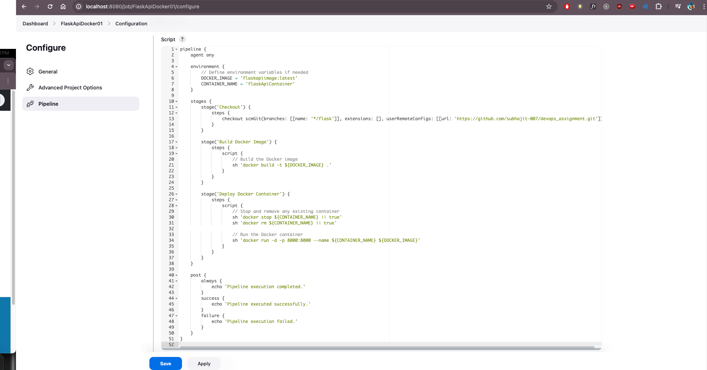

# Devops Assignment
---

## Github repo guide

* Added Two branches to simplify all the task codes.

* There are two branch for `simple-python-code` build and test pipeline task and `Flask-api` build and deploy task named as `python` and `flask` respectively.

* Each branch has the code for the different task.

* `main` Branch contains the Readme and the screenshots of the tasks. Also added other branches code in two folders, however to run and test codes, need to checkout respective branches. 

---

### Documentation and task screenshots

1. Screenshot of Installation and integration of plugins on jenkins.

2. Create freestyle Jenkins job to download code from Git

Console output after successfull fetch

3. Create pipeline to build and test basic python code
- FetchPythonCodeToBuildAndTest

- Test Case passed logged messages

- Pipeline script for the above

3. Create freestyle Jenkins pipeline to build and deploy a restful Flask API using Docker
- Pipeline Script

- FlaskApi Deployed on Docker Success Logs 

- Docker Container Screenshot

---
